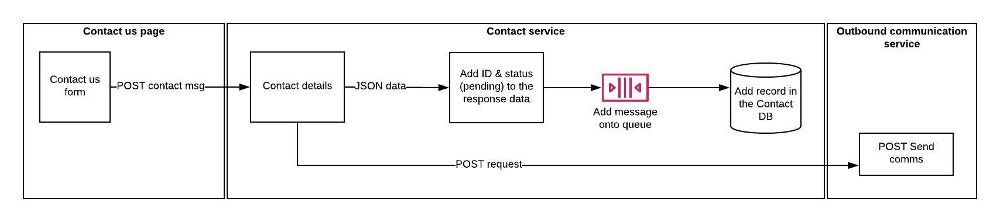

# Contact service

A full Restful CRUD API for managing contacts written in Node.js, Express and MongoDB.



## Steps to setup the service

**Install dependencies**

```bash
npm install
```
**Run Server**

```bash
node server.js
```

## Run the contact API
**You can browse the api at:** <http://localhost:5000>

Here are the following API endpoints:

1.	Create a new contact: **POST** http://localhost:5000/contacts
2.	Retrieve all contacts: **GET** http://localhost:5000/contacts
3.	Retrieve a single contact with contactId: **GET** http://localhost:5000/contacts/{contactId}
4. Update a Contact with contactId: **PUT** http://localhost:5000/contacts/{contactId}
5. Delete a Contact with contactId: **DELETE** http://localhost:5000/contacts/{contactId}

## Run unit tests

